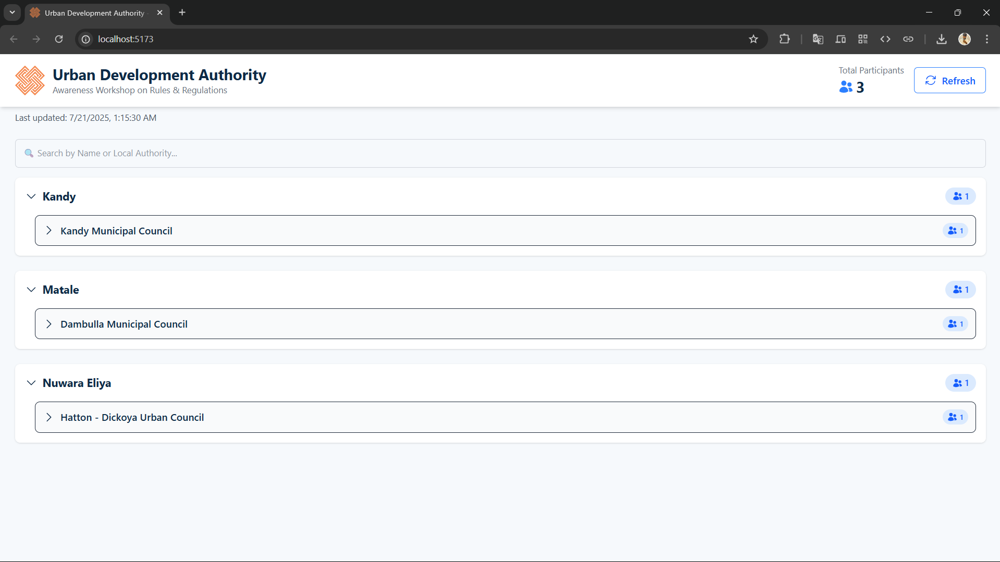

# 🏛️ UDA Participant Dashboard

A real-time web-based dashboard for managing and displaying Urban Development Authority (UDA) awareness workshop participant data — built using Google Forms + Google Sheets + React.

---

## 📌 Project Purpose

This dashboard helps UDA officials to:

- View real-time registrations from a Google Form
- Filter by District → Local Authority → Designation
- See participant names, counts, and designations
- Search by full name or authority
- Display on projector/TV screen for awareness events

---

## 🚀 Live Link

> https://uda-dashboard.vercel.app/

---

## 🛠️ Tech Stack

| Layer       | Tech                                |
|-------------|-------------------------------------|
| Frontend    | React + Vite                        |
| Styling     | Tailwind CSS + Heroicons            |
| Data Source | Google Sheet via [Sheet.best](https://sheet.best) |
| Hosting     | Vercel (CI/CD from GitHub)          |

---

## ✅ Features
- 📊 Real-time data sync from Google Form
- 📍 District → Authority → Designation structure
- 👥 Participant name + designation display
- 🔍 Search by name or local authority
- 🔁 Refresh manually anytime
- 🧼 Government-grade UI with branding
  
---

## 📸 Screenshot

## 📜 License
!(MIT License)
